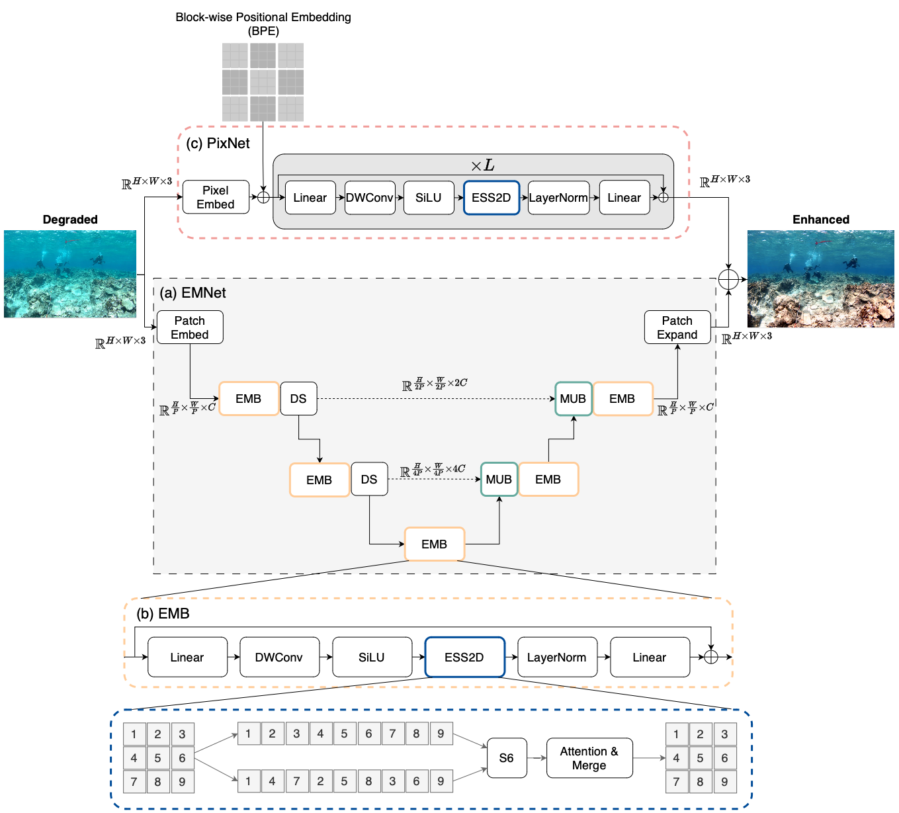

<div align="center">
<h1>PixMamba </h1>
<h3>PixMamba: Leveraging State Space Models in a Dual-Level Architecture for Underwater Image Enhancement</h3>

</div>

* [**abstract**](#abstract)
* [**overview**](#overview--derivations)
* [**citation**](#citation)
* [**acknowledgment**](#acknowledgment)

## Abstract

Underwater Image Enhancement (UIE) is critical for ma- rine research and exploration but hindered by complex distortions and blurring. Existing methods like convolutional neural networks (CNNs) struggle to model long-range dependencies, while transformer networks are computationally impractical for real-word applications. This paper presents PixMamba, a novel architecture to address these challenges. PixMamba leverages State Space Models (SSMs) for efficient long-range dependency modeling, a key advantage over CNNs with limited recep- tive fields and transformers with quadratic computational complexity. SSMs enable PixMamba to capture global contextual information while maintaining computational efficiency. PixMamba employs a dual-level strategy: the Efficient Mamba Net (EMNet) extracts localized patch- level features with a detail-preservation upsampling module, and the PixMamba Net (PixNet), a novel component that efficiently models pixel-level interactions across the entire image, capturing fine-grained features and global consistency that were previously difficult to obtain. PixMamba achieves state-of-the-art performance across various underwa- ter image datasets and delivers visibly superior results.

## Overview


## Citation

```
```

## Acknowledgment

This project is based on Mamba ([paper](https://arxiv.org/abs/2312.00752), [code](https://github.com/state-spaces/mamba)), ConvNeXt ([paper](https://arxiv.org/abs/2201.03545), [code](https://github.com/facebookresearch/ConvNeXt)), [OpenMMLab](https://github.com/open-mmlab),[replknet](https://github.com/DingXiaoH/RepLKNet-pytorch/tree/main/erf), VMamba([paper](https://arxiv.org/abs/2401.10166), [code](https://github.com/MzeroMiko/VMamba)), and 
VM-UNet([paper](https://arxiv.org/abs/2402.02491), [code](https://github.com/JCruan519/VM-UNet)) from their excellent works.

